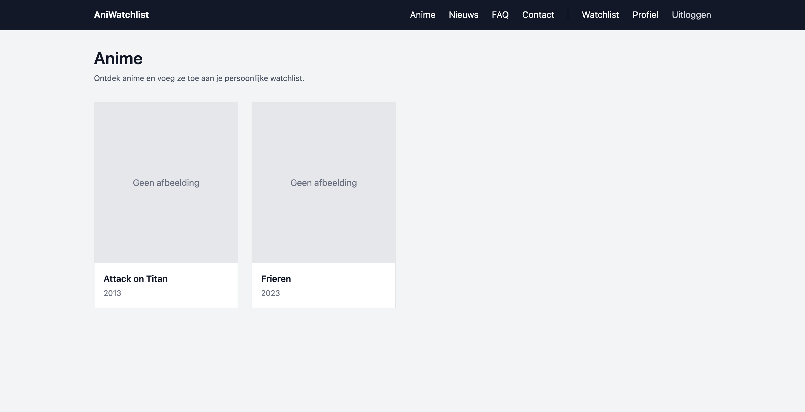
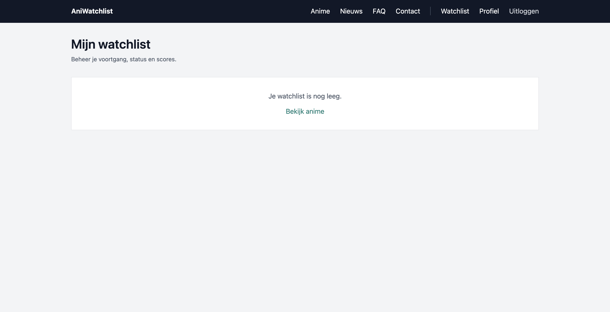
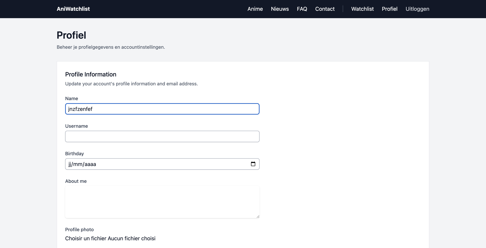
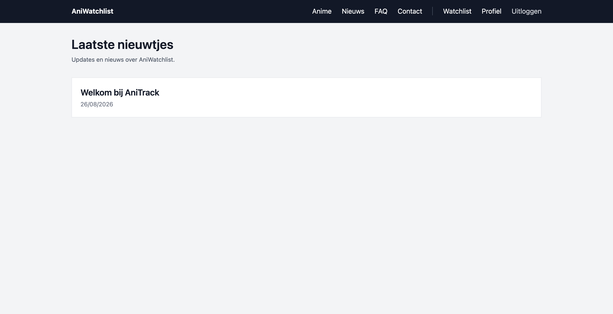
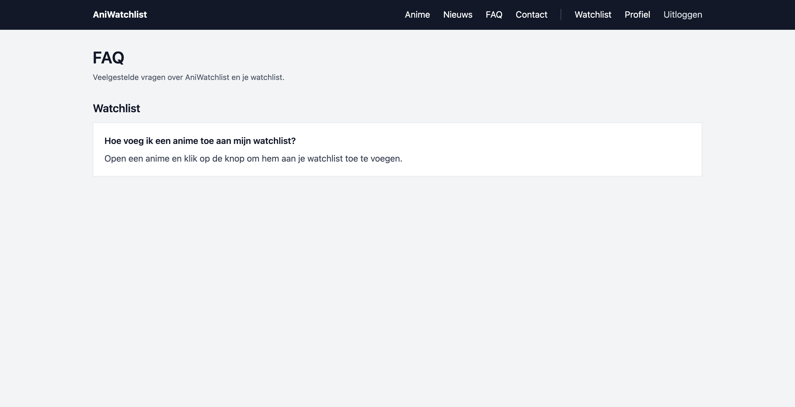
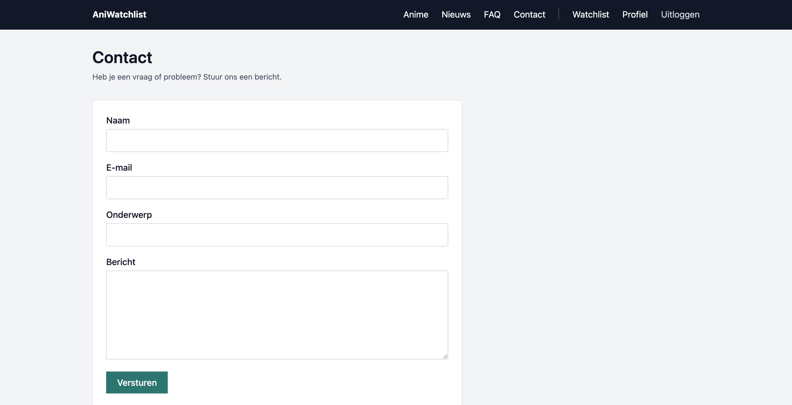
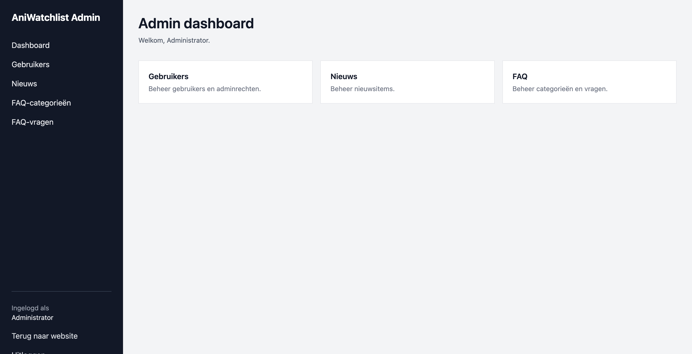
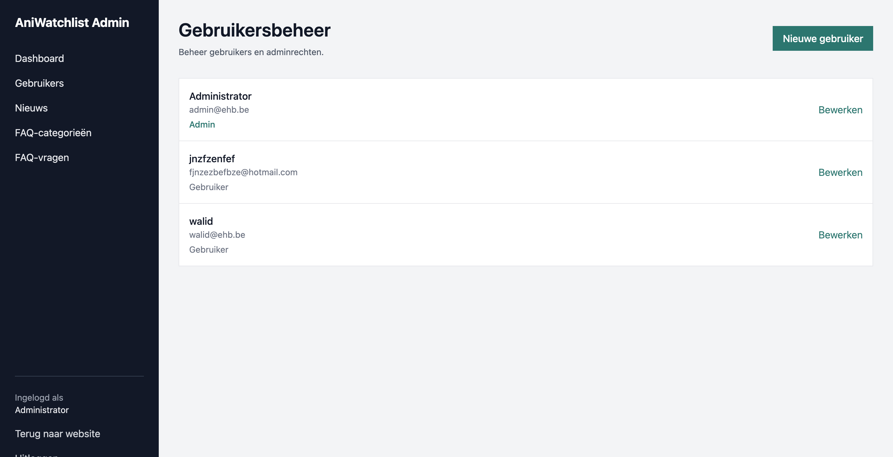

# AniWatchlist

AniWatchlist is een Laravel-webapplicatie waarmee gebruikers anime kunnen bekijken en beheren in een persoonlijke watchlist.

Daarnaast bevat de applicatie publieke profielen, nieuwsberichten, een FAQ, een contactformulier en een apart adminpaneel.

## Technologieën

- Laravel 13
- PHP
- MySQL
- Blade
- Tailwind CSS 4
- Composer
- Laravel Herd

## Functionaliteiten

Gebruikers kunnen:

- Registreren, inloggen en uitloggen
- Wachtwoord resetten en "remember me" gebruiken
- Hun profiel aanpassen
- Een profielfoto uploaden
- Publieke profielen bekijken
- Anime bekijken
- Anime toevoegen aan een watchlist
- Status, score en bekeken afleveringen aanpassen
- Nieuws bekijken
- FAQ bekijken
- Een contactbericht versturen

Administrators kunnen:

- Gebruikers aanmaken en aanpassen
- Adminrechten toekennen of verwijderen
- Nieuws beheren
- FAQ-categorieën beheren
- FAQ-vragen beheren

## Database relaties

De applicatie bevat een many-to-many relatie tussen `User` en `Anime`.

Pivot table:

`anime_user`

Extra velden:

- `status`
- `rating`
- `episodes_watched`

Daarnaast is er een one-to-many relatie tussen `FaqCategory` en `Faq`.

## Belangrijke bestanden

Routes:

`routes/web.php`

Modellen:

- `app/Models/User.php`
- `app/Models/Anime.php`
- `app/Models/NewsItem.php`
- `app/Models/Faq.php`
- `app/Models/FaqCategory.php`

Controllers:

- `app/Http/Controllers/AnimeController.php`
- `app/Http/Controllers/WatchlistController.php`
- `app/Http/Controllers/NewsController.php`
- `app/Http/Controllers/FaqController.php`
- `app/Http/Controllers/ContactController.php`
- `app/Http/Controllers/Admin/`

Eigen admin middleware:

`app/Http/Middleware/AdminMiddleware.php`

Layouts:

- `resources/views/components/layouts/site.blade.php`
- `resources/views/components/layouts/admin.blade.php`

Eigen Blade component:

`resources/views/components/form-input.blade.php`

## Beveiliging

De applicatie maakt gebruik van:

- Laravel authenticatie
- `auth` middleware
- Eigen `admin` middleware
- CSRF-bescherming
- Server-side validatie
- Client-side HTML-validatie
- Blade escaping tegen XSS

## Standaard administrator

Na het uitvoeren van de seeder:

**Username:** `admin`

**E-mail:** `admin@ehb.be`

**Wachtwoord:** `Password!321`

## Installatie

```bash
git clone https://github.com/Walid-Oum/anime-watchlist.git
cd anime-watchlist
composer install
cp .env.example .env
php artisan key:generate
```

Configureer daarna de database in `.env`.

Voer vervolgens uit:

```bash
php artisan storage:link
php artisan migrate:fresh --seed
```

Start de applicatie via Laravel Herd of:

```bash
php artisan serve
```

Voor lokaal testen van het contactformulier kan in `.env` gebruikt worden:

```env
MAIL_MAILER=log
```

De verstuurde e-mail is dan terug te vinden in:

`storage/logs/laravel.log`

## Screenshots

















## Bronnen

- Laravel documentatie: https://laravel.com/docs
- Tailwind CSS: https://tailwindcss.com/
- Door de docent voorziene Laravel starterpack
- OpenAI ChatGPT voor uitleg, debugging, codecontrole en ondersteuning tijdens de ontwikkeling


## Auteur

Walid Oumass  
Backend Web  
Erasmushogeschool Brussel
